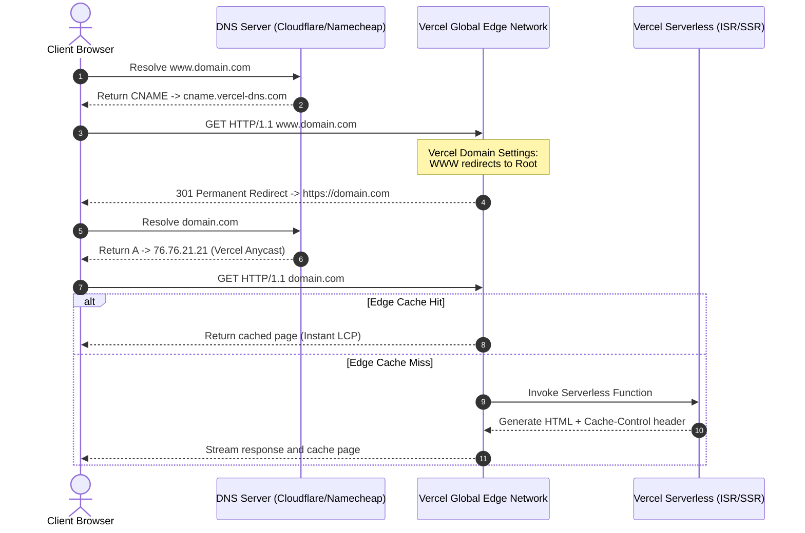

# 🚢 Next.js Hosting & Serverless Infrastructure (Vercel)

This playbook defines our production standards for hosting Next.js projects on Vercel's global serverless network.

---

## 🗺️ DNS & Edge Redirection Workflow

This diagram illustrates how Vercel resolves custom domains and handles edge redirections to maintain a single canonical URL structure (`domain.com` as primary, redirecting `www.domain.com`):



---

## ☁️ 1. Execution Runtimes

*   **Vercel Serverless Functions (Node.js/AWS Lambda)**: Our default execution choice for dynamic page queries, API requests, and general Next.js page generation. It offers full Node.js API support and high memory bounds.
*   **Vercel Edge Functions (V8 Engine)**: Used for extremely fast middleware, geo-targeting, A/B testing routing, and high-performance serverless endpoints. Edge functions run globally at low latencies but have a restricted Node.js module API set.
*   **Incremental Static Regeneration (ISR)**: For dynamic content (such as dynamic product catalogs or blogs), utilize ISR to update static pages in the background *after* deployment without rebuilding the entire repository:
    ```typescript
    // Revalidate this page once per hour
    export const revalidate = 3600; 
    ```

---

## 🛡️ 2. Security & Vercel Firewall

*   **Header Policies**: Configure secure headers directly inside `next.config.ts` (or `next.config.js`) to enforce Content Security Policies (CSP), HSTS, and X-Content-Type security boundaries.
*   **Deployment Protection**: Enforce password protection on preview branches to prevent search engines from index-crawling active staging URLs.

---

## ⚡ 3. Edge Caching & Speed Insights

*   **Vercel Edge Network (Edge Cache)**: Leverage Vercel's global CDN by configuring explicit `Cache-Control` headers for dynamic endpoints and static assets:
    ```http
    Cache-Control: public, max-age=0, s-maxage=31536000, stale-while-revalidate=60
    ```
*   **Speed Insights & Web Vitals**: Toggle **Vercel Speed Insights** in the project settings panel to track live, real-user Core Web Vitals (LCP, INP, CLS) in production.
*   **Edge Config**: Utilize **Vercel Edge Config** to store and read global state variables (e.g. maintenance toggles, feature flags) at sub-millisecond speeds directly at the edge without querying a central database.

---

## 📋 4. SOP: Custom Domain Routing & DNS Canonicalization

**Objective**: To safely route both Root (`example.com`) and Subdomain (`www.example.com`) to Vercel and leverage its built-in redirection engine for perfect SEO canonicalization.

### Step 1: Add Custom Domains inside Vercel Dashboard
Unlike other platforms, Vercel natively manages 301 redirects and SSL handshakes during domain setup.
1. Navigate to **Project Settings > Domains**.
2. Add **`domain.com`** (the root domain).
3. Add **`www.domain.com`** (the subdomain).
4. **Enforce Redirect**: Vercel will prompt you to choose which domain should act as the primary, canonical destination. Select **Redirect www.domain.com to domain.com**. Vercel will automatically handle the 301 permanent redirect at the edge network!

### Step 2: DNS Configuration
Add the target records in your domain's DNS manager (e.g., Namecheap or Cloudflare):
*   **For the Root Domain (`domain.com`)**:
    *   **Type**: `A` record
    *   **Name**: `@`
    *   **Value**: `76.76.21.21` (Vercel's Anycast IP)
*   **For the Subdomain (`www.domain.com`)**:
    *   **Type**: `CNAME`
    *   **Name**: `www`
    *   **Value**: `cname.vercel-dns.com`

---

## 🛠️ 5. Crawler Whitelisting: Ahrefs Bot Integration

*If your Vercel deployment has Deployment Protection (Vercel Authentication) enabled, external crawlers like AhrefsBot will be blocked. To bypass authentication for SEO crawlers:*

1.  Navigate to **Project Settings > Deployment Protection** inside Vercel.
2.  Under **Bypass Protection for Automation**, generate a custom **Bypass Token**.
3.  Instruct the crawler to pass this token inside the request headers (e.g. `x-vercel-protection-bypass: <token>`) to allow complete crawlers to access the site.

---

## ⚡ 6. Netlify Next.js Hosting Integration

Deploying Next.js on Netlify is fully supported using the native Next.js Runtime adapter, providing edge rendering and serverless route execution.

### A. Next.js Runtime Adapter
Netlify automatically detects Next.js during the build phase and installs the necessary build plugins. Ensure your build settings inside the Netlify Dashboard are configured as:
*   **Build Command**: `npm run build`
*   **Publish Directory**: `.next`

### B. Configure `netlify.toml` for Security & Redirects
Control caching, custom security headers, and handle canonical WWW-to-Apex redirections directly via your project’s root `netlify.toml` file:

```toml
[build]
  command = "npm run build"
  publish = ".next"

[[headers]]
  for = "/*"
  [headers.values]
    X-Content-Type-Options = "nosniff"
    X-Frame-Options = "SAMEORIGIN"
    Referrer-Policy = "strict-origin-when-cross-origin"
    Content-Security-Policy = "default-src 'self'; script-src 'self' 'unsafe-inline' 'unsafe-eval' https://www.googletagmanager.com; style-src 'self' 'unsafe-inline' https://fonts.googleapis.com; font-src 'self' https://fonts.gstatic.com; img-src 'self' data: https://images.unsplash.com;"

[[headers]]
  for = "/_next/static/*"
  [headers.values]
    Cache-Control = "public, max-age=31536000, immutable"

[[redirects]]
  from = "https://www.yourdomain.com/*"
  to = "https://yourdomain.com/:splat"
  status = 301
  force = true
```

### C. Environment Variables on Netlify
Ensure your Netlify dashboard contains all required runtime variables (e.g., database links, Resend API key) under **Site configuration > Environment variables**.
